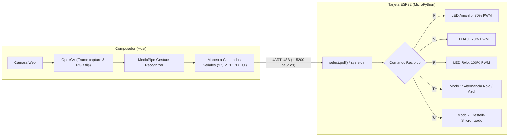

# Actividad 4: Control de LEDs (PWM e Interrupciones) mediante Reconocimiento de Gestos de la Mano

**Universidad Militar Nueva Granada**  
**Facultad de Ingeniería — Microcontroladores**

---

## 📋 Descripción del Proyecto

Esta actividad implementa un sistema ciberfísico interactivo de visión artificial y control embebido en tiempo real. Mediante una cámara web y modelos de aprendizaje profundo (**MediaPipe Gesture Recognizer**), se reconocen gestos específicos de la mano humana en el ordenador host (PC). Estos gestos son traducidos en comandos seriales enviados a un microcontrolador **ESP32** con **MicroPython**, el cual controla tres diodos LED mediante modulación por ancho de pulsos (**PWM**) y secuencias dinámicas de iluminación (modos de interrupción).

---

## 🎯 Objetivos

1. **Visión por Computador:** Capturar video en vivo y detectar puntos de referencia de la mano (*Hand Landmarks*) y gestos predefinidos usando Google MediaPipe.
2. **Comunicación Serial:** Transmitir comandos codificados vía UART/USB entre la PC y el ESP32 con control de frecuencia para evitar sobrecarga del bus.
3. **Control por Hardware Embebido:** Manejar señales PWM a 1 kHz con resolución de 10 bits (0–1023) en MicroPython para modular la luminosidad de los LEDs en distintos porcentajes (30%, 70% y 100%).
4. **Respuesta no bloqueante:** Implementar sondeo no bloqueante (`select.poll()`) en la ESP32 para procesar eventos y ejecutar secuencias de luces programadas sin congelar la recepción de nuevos datos.

---

## 🛠️ Requisitos del Sistema

### Hardware
- Tarjeta de desarrollo **ESP32** (NodeMCU-32S o equivalente).
- Cable micro-USB a USB-A para programación y comunicación serial.
- 1 × LED Amarillo.
- 1 × LED Azul.
- 1 × LED Rojo.
- 3 × Resistencias limitadoras de corriente (220 Ω o 330 Ω recomendadas).
- Protoboard y cables de conexión jumper (Macho-Hembra / Macho-Macho).
- PC con cámara web integrada o externa.

### Software y Entorno
- **Python 3.9+** en el equipo host.
- Entorno virtual con las dependencias:
  - `opencv-python`
  - `mediapipe`
  - `pyserial`
- Firmware **MicroPython** flasheado en la ESP32 (v1.19 o superior).
- Modelo de gestos de MediaPipe: `gesture_recognizer.task`.

---

## 🔌 Conexión de Pines (Hardware Pinout)

Los cátodos (-) de todos los LEDs van conectados a `GND` de la ESP32 mediante sus respectivas resistencias. Los ánodos (+) van directos a los pines GPIO asignados:

| Componente | Pin ESP32 (GPIO) | Frecuencia PWM | Rango Duty Cycle | Función Asignada |
| :--- | :---: | :---: | :---: | :--- |
| **LED Amarillo** | `GPIO 12` | 1000 Hz | 0 – 1023 | Intensidad al 30% (`duty ≈ 306`) |
| **LED Azul** | `GPIO 14` | 1000 Hz | 0 – 1023 | Intensidad al 70% (`duty ≈ 716`) |
| **LED Rojo** | `GPIO 27` | 1000 Hz | 0 – 1023 | Intensidad al 100% (`duty = 1023`) |
| **Tierra Común** | `GND` | — | — | Retorno común de los 3 LEDs |

---

## ✋ Mapeo de Gestos, Comandos y Respuestas

De acuerdo a los lineamientos de la actividad y la detección de puntos clave de la mano (21 landmarks de MediaPipe), se define la siguiente lógica de control:

| Gesto Detectado (MediaPipe) | Comando Serial | Acción en la ESP32 | Detalle de Operación |
| :--- | :---: | :--- | :--- |
| **Puño Cerrado** (`Closed_Fist`) | `'F'` | **30% de Intensidad** | Apaga los demás y enciende el LED Amarillo con un PWM de `30%` (`duty = 306`). |
| **Señal de Victoria / Paz** (`Victory`) | `'V'` | **70% de Intensidad** | Apaga los demás y enciende el LED Azul con un PWM de `70%` (`duty = 716`). |
| **Palma Abierta** (`Open_Palm`) | `'P'` | **100% de Intensidad** | Apaga los demás y enciende el LED Rojo con un PWM de `100%` (`duty = 1023`). |
| **Pulgar Abajo** (`Thumb_Down`) | `'D'` | **Primera Interrupción (Modo 1)** | Secuencia de luces 1: Parpadeo alterno entre LED Rojo y LED Azul (3 ciclos). |
| **Pulgar Arriba** (`Thumb_Up`) | `'U'` | **Segunda Interrupción (Modo 2)** | Secuencia de luces 2: Parpadeo simultáneo estroboscópico de los 3 LEDs (4 ciclos). |

---

## 📐 Arquitectura y Flujo de Comunicación



---

## 📂 Estructura de Archivos

```
Actividad_4/
│
├── Act4.py                  # Script en Python ejecutado en la PC (Captura, MediaPipe, Serial TX)
├── main.py                  # Firmware en MicroPython para la ESP32 (Control PWM, Serial RX, Modos)
├── gesture_recognizer.task  # Modelo binario de MediaPipe para reconocimiento de gestos
└── README.md                # Documentación técnica completa de la actividad
```

---

## 🔍 Explicación del Código

### 1. Script de Visión en PC (`Act4.py`)
- **Captura e inversión de imagen:** Se obtiene cada cuadro de la cámara web mediante `cv2.VideoCapture(0)` y se le aplica `cv2.flip(frame, 1)` para que funcione en modo espejo.
- **Inferencia de Gestos:** Se inicializa `vision.GestureRecognizer` con el archivo `gesture_recognizer.task`. En cada frame se evalúan los puntos de la mano y se extrae `recognition_result.gestures[0][0].category_name`.
- **Filtro antirreboce y transmisión:** Para no colapsar el buffer de entrada del puerto serie, se envía el carácter únicamente si el gesto ha cambiado o si ha transcurrido más de 1.0 segundo (`(tiempo_actual - tiempo_ultimo_envio) > 1.0`).
- **Interfaz de usuario:** Se dibuja sobre la pantalla el nombre del gesto reconocido en tiempo real y se ofrece salida limpia con la tecla `ESC`.

### 2. Firmware en ESP32 (`main.py`)
- **Configuración PWM:** Se configuran canales PWM independientes en los pines 12, 14 y 27 a 1 kHz con `machine.PWM()`. En MicroPython para ESP32, el ciclo de trabajo se gestiona en un rango de 10 bits de 0 a 1023.
- **Entrada no bloqueante con `select.poll`:** En lugar de utilizar `sys.stdin.read(1)` directamente (lo cual detendría la ejecución hasta que llegase un dato), se registra `sys.stdin` en un objeto `select.poll()`. Con `poller.poll(10)` se realiza una espera máxima de 10 ms por datos, permitiendo un bucle fluido.
- **Gestión de Modos:**
  - `'F'`, `'V'`, `'P'`: Calculan el ciclo de trabajo proporcional (`int(1023 * porcentaje)`) apagando previamente los demás LEDs.
  - `'D'` (**Modo 1**): Ejecuta un bucle alternando el encendido del LED rojo y el azul cada 200 ms.
  - `'U'` (**Modo 2**): Enciende y apaga los 3 LEDs a la vez en ráfagas de 300 ms.

---

## 🚀 Guía de Instalación y Puesta en Marcha

### Paso 1: Configurar la ESP32
1. Conectar la ESP32 a la PC por USB.
2. Flashear el firmware de MicroPython en la ESP32 (si no está flasheado previamente).
3. Subir el archivo `main.py` a la raíz del sistema de archivos de la ESP32 (usando Thonny, ampy o el plugin de MicroPython en PyCharm).
4. Reiniciar la ESP32 para que comience a escuchar comandos por el puerto serie.

### Paso 2: Configurar el Entorno en la PC
1. Abrir una terminal en la carpeta del proyecto y activar el entorno virtual de Python.
2. Instalar las dependencias necesarias:
   ```bash
   pip install opencv-python mediapipe pyserial
   ```
3. Descargar el modelo de gestos si no está presente en la carpeta:
   - [gesture_recognizer.task](https://storage.googleapis.com/mediapipe-models/gesture_recognizer/gesture_recognizer/float16/latest/gesture_recognizer.task) y guardarlo como `gesture_recognizer.task` dentro del directorio `Actividad_4`.

### Paso 3: Identificar el Puerto Serial
- En **Windows**: Abrir el Administrador de Dispositivos y verificar el puerto (por ejemplo, `COM3`, `COM4`, etc.).
- En `Act4.py`, verificar que la variable `PUERTO_SERIE` coincida con el puerto detectado:
  ```python
  PUERTO_SERIE = 'COM3'
  ```

### Paso 4: Ejecución
1. Cerrar cualquier programa que esté utilizando el puerto serial (como Thonny o el monitor serie de Arduino) para evitar conflictos de acceso (`Access Denied`).
2. Ejecutar el script:
   ```bash
   python Actividad_4/Act4.py
   ```
3. Colocar la mano frente a la cámara realizando los gestos:
   - **Puño cerrado**: LED Amarillo al 30%.
   - **Victoria**: LED Azul al 70%.
   - **Palma abierta**: LED Rojo al 100%.
   - **Pulgar abajo**: Secuencia parpadeo alternado (Modo 1).
   - **Pulgar arriba**: Secuencia destello conjunto (Modo 2).
4. Presionar `ESC` en la ventana de video para terminar la ejecución.

---

## 📹 Video Demostrativo

> [!NOTE]
> En cumplimiento con el requisito de la actividad ("Crear repositorio en GitHub, explicar el desarrollo, anexar video"), se incluye el enlace al video con la demostración práctica del funcionamiento de la visión por computador, la comunicación serial y la respuesta física de los LEDs en la ESP32:
>
> 🔗 **Enlace del Video:** https://youtu.be/Jd4dkk9pF9Y

---

