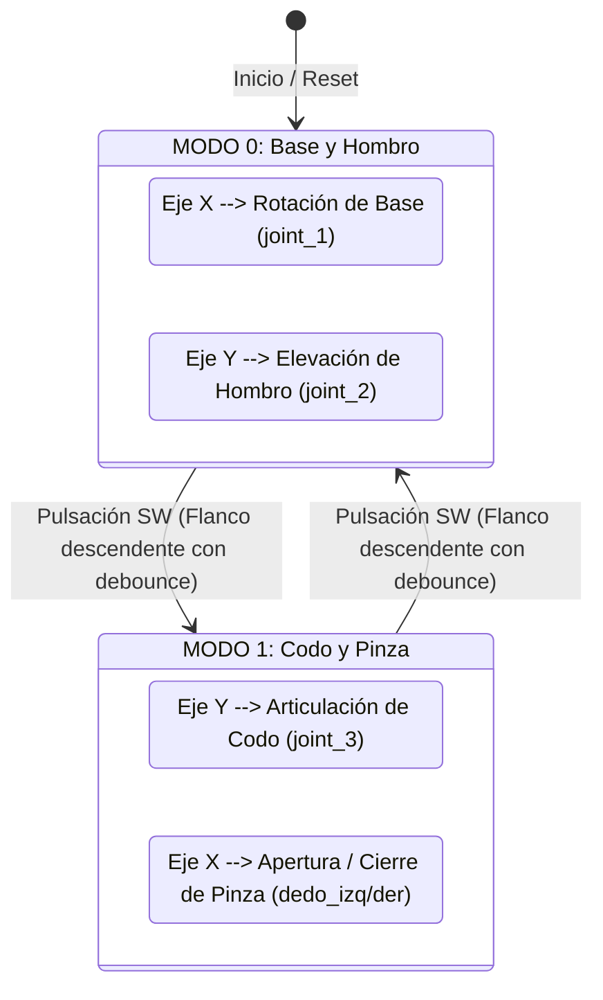

# Actividad 5: Teleoperación de Brazo Robótico en PyBullet mediante Joystick y ESP32

**Universidad Militar Nueva Granada**  
**Facultad de Ingeniería — Microcontroladores**  
**Autor:** Samuel Rubio Tamberg

---

## 📋 1. Resumen y Objetivos de la Actividad

Esta actividad comprende el diseño, modelado cinemático, adquisición de señales analógicas y teleoperación en tiempo real de un **brazo robótico manipulador con pinza (gripper)** simulado en el motor de física **PyBullet**, controlado de forma remota por un microcontrolador **ESP32** acoplado a un **módulo Joystick analógico**.

### Objetivos Específicos
1. **Modelado Robótico (URDF):** Definir la descripción geométrica, inercial y cinemática en formato URDF del manipulador con base rotatoria, articulaciones de hombro y codo, y efector final de dos dedos prismáticos.
2. **Adquisición Embebida (ESP32 / MicroPython):** Muestrear las señales continuas de dos potenciómetros (ejes X e Y) mediante canales ADC de 12 bits y procesar los eventos discretos del pulsador (SW) con filtros de zona muerta y antirrebote.
3. **Canal de Comunicaciones (UART):** Establecer un protocolo serie de baja sobrecarga a 115200 baudios con una cadencia fija de 50 Hz (~20 ms) para asegurar control continuo sin buffering ni desfase temporal.
4. **Control Cinemático y Visualización (Host PC):** Implementar la lógica de control conmutable en Python para gobernar las 4 libertades del manipulador (Base, Hombro, Codo y Pinza) e integrar una interfaz de telemetría gráfica en pantalla.

---

## 📐 2. Arquitectura del Sistema y Flujo de Datos

```mermaid
flowchart LR
    subgraph HardEmbebido ["Nodo Embebido (ESP32)"]
        Joy["Módulo Joystick (VRx, VRy, SW)"] --> ADC["Lectura ADC1 (GPIO 34 / 35) + GPIO 32"]
        ADC --> Filtro["Filtrado (Deadband & Debounce)"]
        Filtro --> MaqModo["Máquina de Estados de Modo (Modo 0 / Modo 1)"]
        MaqModo --> UART_TX["UART Serial TX (115200 bps)"]
    end

    subgraph HostPC ["Nodo Host (PC / Python)"]
        UART_RX["UART Serial RX (pyserial)"] --> Parser["Parser de Trama Telemétrica"]
        Parser --> Control["Integrador Cinemático Incremental"]
        Control --> PyBullet["Motor de Física PyBullet (brazo_robot.urdf)"]
        PyBullet --> Render["Visualizador 3D + HUD Telemetría"]
    end

    UART_TX -- "Cable USB (COMx)" --> UART_RX
```



---

## 🔌 3. Especificación de Hardware y Pinout (ESP32)

Se utiliza el bloque **ADC1** de la ESP32 (los canales de ADC2 se reservan para evitar colisiones con el subsistema Wi-Fi/Bluetooth):

| Pin Joystick | Pin ESP32 (GPIO) | Canal / Periférico | Configuración / Rango | Función Asignada |
| :--- | :---: | :---: | :---: | :--- |
| **GND** | `GND` | Tierra de Referencia | 0 V | Retorno de corriente común |
| **+5V / VCC** | `3V3` o `VIN` | Alimentación | 3.3 V | Polarización de los potenciómetros |
| **VRx** | `GPIO 34` | `ADC1_CH6` | Entrada Analógica (11 dB, 12-bit: 0–4095) | Desplazamiento eje horizontal (X) |
| **VRy** | `GPIO 35` | `ADC1_CH7` | Entrada Analógica (11 dB, 12-bit: 0–4095) | Desplazamiento eje vertical (Y) |
| **SW** | `GPIO 32` | `GPIO Digital` | Entrada Digital con `PULL_UP` interno | Pulsador para conmutar modo de control |

---

## 🦾 4. Modelo Cinemático del Robot (`brazo_robot.urdf`)

El manipulador fue modelado respetando la distribución de colores y estructura mostrada en la guía docente:

| Eslabón / Joint | Tipo de Articulación | Eje de Movimiento | Rango Operativo | Color / Material | Función |
| :--- | :---: | :---: | :---: | :---: | :--- |
| `base_link` | Fijo | — | — | Azul celeste | Cilindro de soporte anclado al suelo |
| `joint_1` | Revolute | Yaw ($Z$) | $-180^\circ$ a $+180^\circ$ ($\pm \pi$ rad) | Naranja | Rotación continua de la base |
| `joint_2` | Revolute | Pitch ($Y$) | $-114^\circ$ a $+114^\circ$ ($\pm 2.0$ rad) | Naranja / Rojo | Elevación del hombro |
| `joint_3` | Revolute | Pitch ($Y$) | $-143^\circ$ a $+143^\circ$ ($\pm 2.5$ rad) | Verde | Articulación del codo |
| `pinza_base` | Fijo a `brazo2` | — | — | Gris oscuro | Bloque porta-pinza |
| `dedo_izq` | Prismatic | Desplazamiento ($X$) | $-20\text{ mm}$ a $+30\text{ mm}$ | Rojo | Dedo izquierdo de la pinza |
| `dedo_der` | Prismatic | Desplazamiento ($-X$) | $-20\text{ mm}$ a $+30\text{ mm}$ | Rojo | Dedo derecho de la pinza |

---

## 🕹️ 5. Esquema de Control Conmutable

Dado que un joystick dispone de dos grados de libertad analógicos (X, Y) y el robot cuenta con 4 articulaciones controlables, se implementa una **arquitectura modal gobernada por el pulsador SW**:



### Comportamiento Cinemático:
- **Control Incremental Suave:** Al desviar la palanca respecto a su centro, el ángulo de la articulación correspondiente cambia a una tasa proporcional a la desviación ($\theta_{t} = \theta_{t-1} + v \cdot \text{norm} \cdot \Delta t$).
- **Retención de Posición en Reposo:** Cuando el joystick se suelta y regresa a su posición central, entra en acción la **zona muerta**, reteniendo la articulación en su última pose de manera firme y precisa.

---

## 📂 6. Estructura de Archivos en `Actividad_5`

```
Actividad_5/
│
├── brazo_robot.urdf     # Modelo cinemático completo (Base, Hombro, Codo, Pinza)
├── main_esp32.py        # Firmware MicroPython para adquisición y transmisión UART (ESP32)
├── control_robot.py     # Script Host en Python (PyBullet, lectura serial y cinemática)
└── README.md            # Documentación técnica, manual de ingeniería y conexiones
```

---

## 🔍 7. Explicación de los Módulos de Software

### 7.1 Firmware ESP32 (`main_esp32.py`)
- **Zona Muerta:** Los potenciómetros comerciales presentan ruido eléctrico y una pequeña variación alrededor del valor central (~2048). La función `normalizar_eje()` define una banda de $\pm 250$ unidades ADC en la que la salida es forzada a $0.0$, eliminando el temblor (*jitter*).
- **Detección de Flanco y Antirrebote:** Se verifica la transición de $1 \rightarrow 0$ en `btn_sw` con un retardo por temporizador de software (`DEBOUNCE_MS = 250`), alternando de forma confiable entre `modo_actual = 0` y `modo_actual = 1`.
- **Protocolo de Trama:** Transmite en formato CSV estándar:
  $$\text{Trama: } \texttt{<X>,<Y>,<SW\_TRIGGER>,<MODO>\textbackslash n}$$
  Ejemplo: `0.75,-0.20,0,1\n`

### 7.2 Script de Control Host (`control_robot.py`)
- **Gestión de Conexión Serial Resiliente:** Si el microcontrolador no está conectado o el puerto está ocupado, el script activa automáticamente un **modo de respaldo**, permitiendo operar el robot mediante el teclado numérico (`[1]`, `[2]`, `[Espacio]` y flechas de dirección).
- **Control de Actuadores:** Aplica la función de control de posición de PyBullet:
  ```python
  p.setJointMotorControl2(robot_id, idx, p.POSITION_CONTROL, targetPosition=pos, force=F)
  ```
- **HUD de Telemetría Dinámico:** Mediante `p.addUserDebugText` superpone en la escena tridimensional el modo activo, las coordenadas instantáneas del joystick y los valores angulares/milimétricos de cada unión.

---

## 🚀 8. Guía de Puesta en Marcha

### Paso 1: Instalación de Dependencias en la PC
En la terminal del entorno virtual de Python:
```bash
pip install pybullet pyserial
```

### Paso 2: Flasheo y Ejecución en la ESP32
1. Conectar la ESP32 al puerto USB.
2. Abrir Thonny u otra herramienta de carga de MicroPython.
3. Cargar el archivo `Actividad_5/main_esp32.py` en la ESP32 con el nombre `main.py` (para arranque automático).
4. Verificar mediante el monitor serie que se reciben líneas continuas de la forma `0.00,0.00,0,0`.
5. **Cerrar el monitor serie de Thonny** para liberar el puerto COM.

### Paso 3: Ejecución de la Simulación en la PC
1. En `control_robot.py`, verificar el puerto asignado (por defecto `COM3`).
2. Ejecutar el script:
   ```bash
   python Actividad_5/control_robot.py
   ```
3. Manipular el joystick:
   - **En Modo 0:** Mover en X para girar la base, en Y para elevar/bajar el hombro.
   - **Presionar el Joystick (SW):** Cambia a Modo 1.
   - **En Modo 1:** Mover en Y para articular el codo, en X para abrir/cerrar la pinza.

---

## 📹 9. Demostración y Validación

> [!NOTE]
> Enlace al video de validación donde se evidencia la lectura de las señales analógicas en la ESP32, la transmisión por UART y la respuesta en tiempo real de las articulaciones y pinza en PyBullet:
>
> 🔗 **Video Demostrativo:** *[Insertar aquí enlace de YouTube / Drive / OneDrive]*

### Pantallazos del Entorno:
*(Adjuntar capturas de pantalla de la ventana interactiva de PyBullet con el HUD de telemetría y el montaje de la ESP32 con el Joystick)*

---

## 👥 10. Información Institucional

- **Estudiante:** Samuel Rubio Tamberg
- **Institución:** Universidad Militar Nueva Granada
- **Facultad:** Facultad de Ingeniería
- **Asignatura:** Microcontroladores
