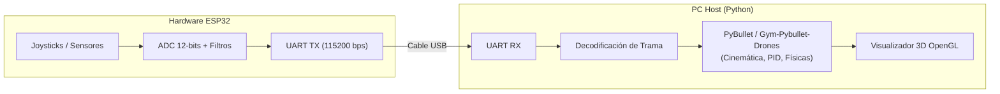
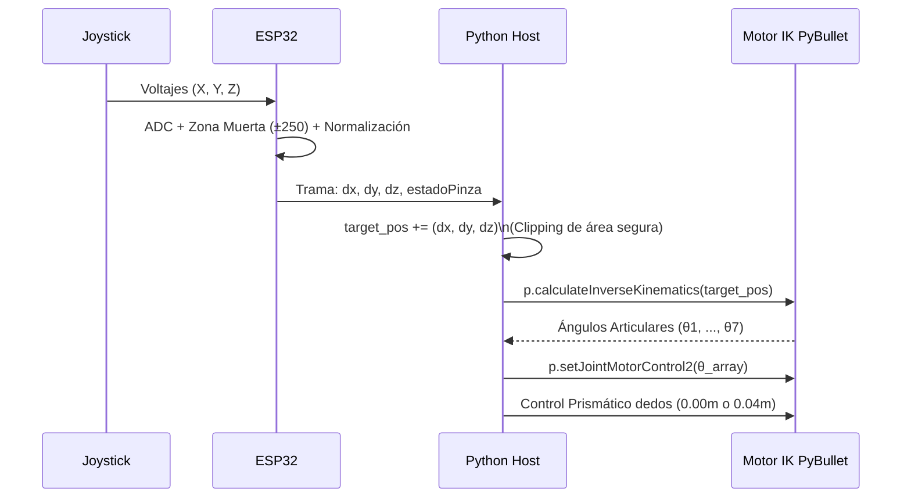

# Práctica Real-to-Sim: Control de Sistemas Robóticos mediante Microcontrolador ESP32

## 1. Información General
* **Asignatura:** Microcontroladores / Robótica
* **Estudiante:** Samuel Rubio Tamberg
* **Código:** 7004288
* **Entorno de Simulación:** Python 3.10+, PyBullet, Gym-Pybullet-Drones
* **Hardware de Control:** Tarjeta de desarrollo ESP32 (Arquitectura UART / Hardware-in-the-Loop)

---

## 2. Descripción General del Proyecto
El objetivo principal de este taller consiste en implementar esquemas de interacción física **Real-to-Sim**, donde una interfaz de hardware real basada en el microcontrolador ESP32 comanda dinámicamente simulaciones robóticas tridimensionales en tiempo real.

La comunicación bidireccional y continua se establece mediante el bus serial USB (UART a 115200 baudios), integrando la adquisición de señales de sensores/mandos físicos con cálculos cinemáticos y dinámicos dentro de entornos desarrollados sobre PyBullet.



El proyecto está dividido en tres escenarios prácticos (**Punto A, Punto B y Punto C**), cada uno abordando un tipo diferente de sistema robótico y estrategia de control.

---

## 3. Desarrollo de los Puntos

### Punto A: Control de Trayectorias de Enjambre de Drones (Gym-Pybullet-Drones)
* **Objetivo:** Gestionar el desplazamiento coordinado de un enjambre de 4 drones entre distintos waypoints (Punto A, Punto B y Punto C) en el espacio 3D, dictados secuencialmente por el ESP32.

#### Arquitectura de Control
```mermaid
flowchart TD
    ESP["ESP32 (Máquina de Estados Temporizada)"] -->|X, Y, Z (20 Hz)| PC["Python Host"]
    PC --> Offset["Distribución en Formación Cuadrada\n(Offsets relativos)"]
    Offset --> D1["Dron 1 (PID DSL)"]
    Offset --> D2["Dron 2 (PID DSL)"]
    Offset --> D3["Dron 3 (PID DSL)"]
    Offset --> D4["Dron 4 (PID DSL)"]
    D1 -.-> Sim["Entorno Físico PyBullet"]
    D2 -.-> Sim
    D3 -.-> Sim
    D4 -.-> Sim
```

* **Implementación en Hardware (ESP32):**
  * El firmware (`PuntoAesp32.ino`) actúa como un generador de trayectorias maestro. Estructura una máquina de estados temporizada sin bloqueos (usando `millis()`) que cambia el objetivo espacial cada 7 segundos.
  * Transmite continuamente (a 20 Hz) los vectores cartesianos objetivo $(X_t, Y_t, Z_t)$ correspondientes a las fases de la misión en formato de texto separado por comas (`X,Y,Z\n`).
* **Implementación en Software (Python/PyBullet):**
  * Se utiliza el entorno multi-agente `CtrlAviary` de la librería `gym-pybullet-drones`, instanciando 4 drones modelo `Crazyflie 2.X` (`CF2X`).
  * El script lee por serial el objetivo central en el espacio 3D y distribuye a cada dron una posición destino aplicando un **offset vectorial** para mantener una formación cuadrada ($[-0.3, \pm 0.3, 0.0]$ y $[0.3, \pm 0.3, 0.0]$).
  * El control de vuelo de bajo nivel de cada dron se resuelve internamente usando lazos de control PID (`DSLPIDControl`), calculando la acción requerida para que el estado de cada dron converja progresivamente a los setpoints transmitidos por el ESP32.

---

### Punto B: Consola de Mandos para Manipulador Colaborativo Baxter (Cinemática Inversa)
* **Objetivo:** Desarrollar una consola de hardware (tipo Joystick) que permita el posicionamiento cartesiano fluido del efector final del robot Baxter, posibilitando alcanzar y agarrar objetos físicos (Pick & Place).

#### Esquema de Pines (ESP32)
| Periférico | Pin ESP32 | Tipo | Rango / Notas |
| :--- | :---: | :---: | :--- |
| **Joystick Eje X** | `GPIO 34` | Entrada Analógica | 0 a 4095 (Mapeado de velocidad X) |
| **Joystick Eje Y** | `GPIO 35` | Entrada Analógica | 0 a 4095 (Mapeado de velocidad Y) |
| **Joystick Eje Z** | `GPIO 32` | Entrada Analógica | 0 a 4095 (Mapeado de velocidad Z) |
| **Botón Pinza** | `GPIO 25` | Entrada Digital | PULL-UP (0 = Abierto, 1 = Cerrado) |
| **Botón Brazo** | `GPIO 26` | Entrada Digital | PULL-UP (Cambio Izq/Der) |

#### Flujo de Cinemática Inversa


* **Implementación en Hardware (ESP32):**
  * Lee analógicamente los potenciómetros y aplica un filtro de zona muerta (*deadzone* de $\pm250$ alrededor del centro 2048) para anular el drift mecánico y estabilizar la lectura.
  * Normaliza la desviación a una escala de velocidad incremental entre $[-1.0, 1.0]$.
  * Evalúa el estado de los pulsadores digitales con algoritmos antirrebote (`delay(250)` tras el flanco). Transmite la trama por UART a 50 Hz.
* **Implementación en Software (Python/PyBullet):**
  * En cada iteración a 60 Hz, el script lee los comandos seriales, los suma a la posición cartesiana actual (`target_pos`) manteniendo la pose dentro de un área segura delimitada (`np.clip`).
  * Utiliza el motor analítico de PyBullet (`p.calculateInverseKinematics`) para calcular los ángulos de cada una de las 7 articulaciones del brazo izquierdo que sitúan el efector final en las coordenadas $(X,Y,Z)$ requeridas, manteniendo siempre una orientación vertical hacia abajo (Pitch $90^\circ$).

---

### Punto C: Teleoperación de Articulaciones en Robot Humanoide (Atlas)
* **Objetivo:** Implementar el control directo en tiempo real de cadenas cinemáticas específicas (hombros y brazos) del robot humanoide Atlas dentro de un escenario robótico.

#### Esquema de Pines (ESP32)
| Periférico | Pin ESP32 | Función Cinemática | Rango Angular Enviado |
| :--- | :---: | :--- | :--- |
| **Potenciómetro 1** | `GPIO 34` | Hombro Pitch (Inclinación) | Incremental (Rad/s) |
| **Potenciómetro 2** | `GPIO 35` | Hombro Roll (Balanceo) | Incremental (Rad/s) |
| **Potenciómetro 3** | `GPIO 32` | Codo Yaw (Giro) | Incremental (Rad/s) |

* **Implementación en Hardware (ESP32):**
  * Convierte las lecturas de los potenciómetros (aplicando zona muerta) a **incrementos angulares** muy pequeños expresados en radianes (factor de escala $0.02$).
  * Emite los deltas angulares $(\Delta \theta_1, \Delta \theta_2, \Delta \theta_3)$ al computador mediante UART a una tasa de refresco constante de 50 Hz.
* **Implementación en Software (Python/PyBullet):**
  * Se soluciona dinámicamente la resolución de dependencias relativas de los archivos de malla `.obj` / `.dae` cambiando el subdirectorio de trabajo (`os.chdir`) a la carpeta base del URDF del modelo Atlas v4.
  * El robot se carga fijado por la pelvis a una plataforma base (`useFixedBase=True`) para garantizar estabilidad estática, aislando el problema de equilibrado dinámico y enfocándose en la cinemática de los miembros superiores.
  * Se aplica una acumulación progresiva e integral (`target_angles[i] += dj_i`), limitada entre $[-1.8, 1.8]$ radianes, y se transmite a los actuadores seleccionados mediante control de posición de motor (`p.setJointMotorControl2`).

---

## 4. Requisitos y Dependencias
Para ejecutar los entornos en la máquina anfitriona, se requiere tener activado un entorno virtual de Python (`.venv`) con las siguientes librerías:

```bash
# Dependencias base
pip install pybullet numpy pyserial

# Repositorio gym-pybullet-drones (Para el Punto A)
pip install git+https://github.com/utiasDSL/gym-pybullet-drones.git
```

*Nota: Los modelos de los robots Baxter (Punto B) y Atlas (Punto C) ya se encuentran incluidos dentro de las carpetas locales del repositorio `baxter_common` y `pybullet_robots`.*

## 5. Instrucciones de Ejecución

Para iniciar cualquiera de los puntos de la práctica:

1. **Grabar el ESP32:** Carga mediante Arduino IDE el firmware `.ino` correspondiente que se encuentra en la subcarpeta del punto a probar (ej. `PuntoA/PuntoAesp32/PuntoAesp32.ino`).
2. **Cerrar Monitor Serie:** Asegúrate de que el monitor serial en Arduino esté cerrado para liberar el puerto COM.
3. **Verificar el Puerto:** Abre el archivo de Python (`PuntoA.py`, `puntoB.py` o `puntoC.py`) y verifica que la constante `PUERTO_SERIAL` coincida con el puerto asignado a tu ESP32 (ej. `'COM4'`).
4. **Ejecutar la Simulación:**
   Ejecuta el script desde tu entorno virtual. Por ejemplo, para el Punto B:
   ```bash
   python "PuntoB/puntoB.py"
   ```
5. **Interactuar:** Usa el circuito de potenciómetros/botones conectado a tu ESP32 para observar los efectos en la ventana 3D de PyBullet.
